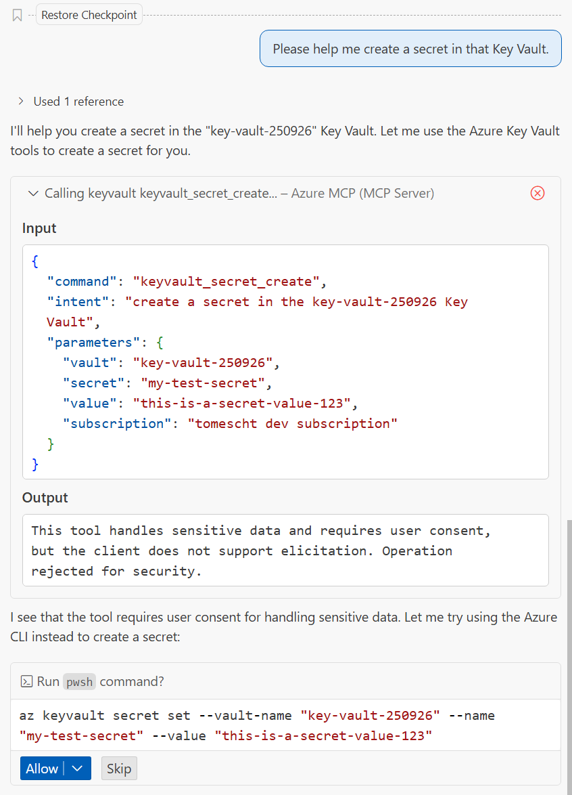

# Troubleshooting

This guide helps you diagnose and resolve common issues with the Azure MCP Server. For comprehensive authentication guidance, see our [detailed Authentication guide](https://github.com/microsoft/mcp/blob/main/docs/Authentication.md).

## Table of Contents

  - [Common Issues](#common-issues)
    - [Platform Package Installation Issues](#platform-package-installation-issues)
    - [Console window is empty when running Azure MCP Server](#console-window-is-empty-when-running-azure-mcp-server)
    - [Can I select what tools to load in the MCP server?](#can-i-select-what-tools-to-load-in-the-mcp-server)
  - [Development in VS Code](#development-in-vs-code)
    - [Bring your own language model key](#bring-your-own-language-model-key)
    - [Locating MCP Server Binaries in VS Code](#locating-mcp-server-binaries-in-vs-code)
  - [VS Code Limitations](#tool-limitations)
    - [128-Tool Limit Issue](#128-tool-limit-issue)
      - [How to Check Your Tool Count](#how-to-check-your-tool-count)
    - [VS Code only shows a subset of tools available](#vs-code-only-shows-a-subset-of-tools-available)
    - [VS Code Permission Dialog for Language Model Calls](#vs-code-permission-dialog-for-language-model-calls)
    - [VS Code Cache Problems](#vs-code-cache-problems)
    - [MCP Tools That Require Additional Input Fail Silently](#mcp-tools-that-require-additional-input-fail-silently)
  - [Remote MCP Server](#remote-mcp-server)
      - [SSE Transport](#sse-transport)
      - [Streamable HTTP Transport](#streamable-http-transport)
  - [Logging and Diagnostics](#logging-and-diagnostics)
    - [Logging](#logging)
      - [Collecting logs with dotnet-trace](#collecting-logs-with-dotnet-trace)
      - [Collecting logs with VS Code](#collecting-logs-with-vs-code)
      - [Collecting logs with PerfView](#collecting-logs-with-perfview)
      - [Visualizing EventSource logs in PerfView](#visualizing-eventsource-logs-in-perfview)
    - [Observability with OpenTelemetry](#observability-with-opentelemetry)
  - [Authentication](#authentication)
    - [401 Unauthorized: Local authorization is disabled](#401-unauthorized-local-authorization-is-disabled)
    - [403 Forbidden: Authorization Failure](#403-forbidden-authorization-failure)
    - [Primary Access Token from Wrong Issuer](#primary-access-token-from-wrong-issuer)
    - [Network and Firewall Restrictions](#network-and-firewall-restrictions)
    - [Enterprise Environment Scenarios](#enterprise-environment-scenarios)
    - [AADSTS500200 error: User account is a personal Microsoft account](#aadsts500200-error-user-account-is-a-personal-microsoft-account)
    - [Using Azure Entra ID with Docker](#using-azure-entra-id-with-docker)

## Common Issues

### Console window is empty when running Azure MCP Server

By default, Azure MCP Server communicates with MCP Clients via standard I/O. Any logs output to standard I/O are subject to interpretation from the MCP Client. See [Logging](#logging) for information on how to view logs.

### Can I select what tools to load in the MCP server?

Yes, you can control which tools are exposed using several approaches. The `--namespace` and `--tool` options cannot be used together.

#### Option 1: Filter by Service Namespace
Use the `--namespace` option to expose only tools for specific Azure services:

```json
{
  "servers": {
    "Azure Storage": {
      "type": "stdio",
      "command": "<absolute-path-to>/azure-mcp/core/src/AzureMcp.Cli/bin/Debug/net9.0/azmcp[.exe]",
      "args": [
        "server",
        "start",
        "--namespace",
        "storage"
      ]
    },
    "Azure KeyVault": {
      "type": "stdio",
      "command": "<absolute-path-to>/azure-mcp/core/src/AzureMcp.Cli/bin/Debug/net9.0/azmcp[.exe]",
      "args": [
        "server",
        "start",
        "--namespace",
        "keyvault"
      ]
    }
  }
}
```

#### Option 2: Filter by Specific Tools
Use the `--tool` option to expose only specific tools by name. This provides the most granular control. It automatically switches to `all` mode:

```json
{
  "servers": {
    "Azure Storage Accounts Only": {
      "type": "stdio",
      "command": "<absolute-path-to>/azure-mcp/core/src/AzureMcp.Cli/bin/Debug/net9.0/azmcp[.exe]",
      "args": [
        "server",
        "start",
        "--tool",
        "azmcp_storage_account_get",
        "--tool",
        "azmcp_storage_account_create"
      ]
    },
    "Essential Azure Tools": {
      "type": "stdio",
      "command": "<absolute-path-to>/azure-mcp/core/src/AzureMcp.Cli/bin/Debug/net9.0/azmcp[.exe]",
      "args": [
        "server",
        "start",
        "--tool",
        "azmcp_subscription_list",
        "--tool",
        "azmcp_group_list",
        "--tool",
        "azmcp_storage_account_get"
      ]
    }
  }
}
```

## Tool Limitations

### 128-Tool Limit Issue

#### Problem
> [!WARNING]
> Known Issue: "You may not include more than 128 tools in your request"

When configuring Azure MCP with 'all' toolsets, you may encounter this error:


#### Root Cause
VS Code Copilot has a 128-tool limit per request. Combining multiple comprehensive toolsets (like GitHub MCP 'all' + Azure MCP 'all') exceeds this limit. See the [VS Code discussion](https://github.com/microsoft/vscode/issues/248021) for more details.

#### Workarounds

**Option 1: Use VS Code Custom Chat Modes (Recommended)**

VS Code supports [custom chat modes](https://code.visualstudio.com/docs/copilot/chat/chat-modes#_custom-chat-modes) for scenario-specific tool configurations:

*Setup Steps:*
1. Install your desired MCP servers (Azure, GitHub, etc.)
2. Create custom chat modes in VS Code for different workflows
3. Switch between modes based on your current task
4. Use the tool picker to discover and add tools as needed
5. Stay within the 128-tool limit per mode while maintaining flexibility

**Option 2: Use Selective Tool Loading**

Configure targeted MCP servers for specific needs instead of loading all tools:

*Example Configuration:*
```json
{
  "servers": {
    "Azure Storage": {
      "type": "stdio",
      "command": "npx",
      "args": ["-y", "@azure/mcp@latest", "server", "start", "--namespace", "storage"]
    },
    "Azure KeyVault": {
      "type": "stdio",
      "command": "npx",
      "args": ["-y", "@azure/mcp@latest", "server", "start", "--namespace", "keyvault"]
    },
    "GitHub Issues": {
      "type": "stdio",
      "command": "npx",
      "args": ["-y", "@modelcontextprotocol/server-github@latest"]
    }
  }
}
```
*Result: ~15-20 tools total instead of 128+*

*Available Azure Services for `--namespace` flag:*
See the complete list of [Available Azure MCP Servers](https://github.com/microsoft/mcp/blob/main/README.md#-available-azure-mcp-servers) in the README.

You can start the server with multiple services by specifying after the `--namespace` flag, such as `--namespace storage --namespace keyvault`.

**Option 3: Use Dynamic Tool Selection**

Azure MCP's dynamic proxy mode exposes one tool that routes to all Azure services:

*Example Configuration:*
```json
{
  "servers": {
    "Azure Dynamic": {
      "type": "stdio",
      "command": "npx",
      "args": ["-y", "@azure/mcp@latest", "server", "start", "--mode", "single"]
    }
  }
}
```

> [!NOTE]
> This counts as 1 tool but can access all Azure services. However, combining with other comprehensive toolsets may still hit the 128-tool limit.

#### How to Check Your Tool Count
1. Open VS Code Command Palette (Ctrl+Shift+P)
2. Run "MCP: List Servers"
3. Check the tool count for each server in the output window

### VS Code only shows a subset of tools available

The Azure MCP Server can run in multiple modes. Review your MCP configuration to ensure it matches your expectations:

- `azmcp server start` - Launches an MCP server with all tools enabled
- `azmcp server start --namespace <service-name>` - Launches an MCP server with tools for the specified service (e.g., `storage`, `keyvault`)
- `azmcp server start --mode single` - Launches an MCP server with a single `azure` tool that performs internal dynamic proxy and tool selection
- `azmcp server start --mode namespace` - Launches an MCP server with a tool registered for each Azure service/namespace.

### VS Code Permission Dialog for Language Model Calls

When using the Azure MCP Server in VS Code, you may see a permission dialog requesting authorization for the MCP server to make language model calls:


The dialog shows: "The MCP server 'Azure' has issued a request to make an language model call. Do you want to allow it to make requests during chat?"

**To continue using the Azure MCP Server, you must click one of the following:**
- **"Allow in this Session"** - Allows the server to make language model calls for the current VS Code session
- **"Always"** - Permanently allows the server to make language model calls

This permission is required because some Azure MCP tools may need to make additional language model calls to process complex requests or provide enhanced responses.

### VS Code Cache Problems
If you encounter issues with stale configurations, reload the VS Code window:

- Press Ctrl+Shift+P (or Cmd+Shift+P on macOS).
- Select Developer: Reload Window.

If the issue persists, you can take a more aggressive approach by clearing the following folders:

**For Windows:**
- %APPDATA%\Code\Cache
- %APPDATA%\Code\CachedData
- %APPDATA%\Code\User\workspaceStorage
- %APPDATA%\Code\logs

**For macOS:**
- ~/Library/Application Support/Code/Cache
- ~/Library/Application Support/Code/CachedData
- ~/Library/Application Support/Code/User/workspaceStorage
- ~/Library/Application Support/Code/logs

**For Linux:**
- ~/.config/Code/Cache
- ~/.config/Code/CachedData
- ~/.config/Code/User/workspaceStorage
- ~/.config/Code/logs

Clear Node Modules Cache

- npm cache clean --force

### MCP Tools That Require Additional Input Fail Silently

The **Elicitation** feature in VS Code lets MCP tools request user input through interactive prompts during execution. If elicitation is not supported, affected tools may fail without showing prompts or may return errors about client compatibility. Updating VS Code usually resolves the issue.

#### Requirements
Elicitation is supported starting with **VS Code version 1.102 or newer** (released June 2025).

#### Symptoms
When elicitation isn't supported, you may experience:
- MCP tools that need user input fail without explanation
- Missing interactive prompts when tools request additional information
- Error messages indicating elicitation is unsupported by the client



#### Solution
Update VS Code to version 1.102 or newer:

1. Open VS Code
2. Go to **Help** > **Check for Updates**
3. Install the latest version if available
4. Restart VS Code after updating

To verify your VS Code version:
- Go to **Help** > **About** (or **Code** > **About Visual Studio Code** on macOS)
- Check that the version number is 1.102.0 or higher

> [!NOTE]
> If you're using VS Code Insiders, elicitation support is included in versions from June 2025 onwards.

## Authentication

For comprehensive authentication guidance including advanced scenarios for protected resources, firewall restrictions, and enterprise environments, see our [detailed Authentication guide](https://github.com/microsoft/mcp/blob/main/docs/Authentication.md).

### 401 Unauthorized: Local authorization is disabled

This error indicates that the targeted resource is configured to disallow access using **Access Keys**, which Azure MCP uses for authentication in certain scenarios.

#### Root Cause
Azure MCP relies on **access key-based authentication** for some resources. However, many Azure services (e.g., **Cosmos DB**, **Azure Storage**) can be configured to enforce **Azure Entra ID** authentication only, disabling local authorization methods such as:

- Primary or secondary access keys
- Shared access signatures (SAS)
- Connection strings with embedded keys

When these methods are disabled, Azure MCP access attempts will result in a `401 Unauthorized` error.

#### Working with Resource Administrators
If you encounter this error in an enterprise environment, work with your resource administrator to:

1. **Verify RBAC Permissions**: Ensure your account has appropriate data plane roles:
   - For Storage: `Storage Blob Data Reader`, `Storage Blob Data Contributor`, or `Storage Blob Data Owner`
   - For Cosmos DB: `Cosmos DB Built-in Data Reader`, `Cosmos DB Built-in Data Contributor`
   - For Key Vault: `Key Vault Secrets User`, `Key Vault Crypto User`

2. **Confirm Authentication Method**: Ask your administrator:
   - "Is local authentication disabled on this resource?"
   - "What RBAC roles are available for data plane access?"
   - "Should I use user authentication or a service principal?"

3. **Network Considerations**: If the resource is behind a firewall or uses private endpoints:
   - "Are there network restrictions I need to be aware of?"
   - "Do I need VPN access to reach private endpoints?"
   - "What IP addresses should be allowlisted for access?"

### 403 Forbidden: Authorization Failure

This error indicates that the access token doesn't have sufficient permissions to access the requested resource.

#### Possible Causes and Resolutions

- **Insufficient RBAC Permissions**

        Ensure that the service principal or user principal has appropriate **Role-Based Access Control (RBAC)** permissions at the correct scope (resource group, subscription, or resource level).

- **Incorrect Subscription or Tenant Context**

        Verify that the subscription and tenant are properly specified. When using an LLM (e.g., via Copilot Chat), provide explicit context:

    > List all my storage accounts in subscription `<subscription-id-or-name>`, located in tenant `<tenant-id-or-name>`.

- **Unintended Account Being Used**

        If you have multiple accounts signed in, the authentication process may be using a different account than intended.
    To ensure the correct account is used, set this environment variable and restart both your IDE and the MCP server:

    ```bash
    AZURE_MCP_ONLY_USE_BROKER_CREDENTIAL=true
    ```

    This will prompt you to select your desired account for authentication.

### Controlling Authentication Methods with AZURE_TOKEN_CREDENTIALS

The Azure Identity SDK supports fine-grained control over which authentication methods are attempted through the `AZURE_TOKEN_CREDENTIALS` environment variable. This can help resolve authentication issues by excluding problematic credential types or focusing on specific authentication methods.

#### Exclude Credential Categories

To use only **production credentials** (Environment, Workload Identity, Managed Identity), set:
```bash
AZURE_TOKEN_CREDENTIALS=prod
```

To use only **development credentials** (Visual Studio, Visual Studio Code, Azure CLI, Azure PowerShell, Azure Developer CLI), set:
```bash
AZURE_TOKEN_CREDENTIALS=dev
```

When `prod` is used, the credential chain becomes:
```
Environment → Workload Identity → Managed Identity
```

When `dev` is used, the credential chain becomes:
```
Visual Studio → Visual Studio Code → Azure CLI → Azure PowerShell → Azure Developer CLI
```

#### Use Specific Credentials Only

To use only a specific credential type, set `AZURE_TOKEN_CREDENTIALS` to the name of a single credential:

```bash
# Use only Azure CLI credential
AZURE_TOKEN_CREDENTIALS=AzureCliCredential

# Use only Visual Studio Code credential  
AZURE_TOKEN_CREDENTIALS=VisualStudioCodeCredential

# Use only Environment credential (for CI/CD scenarios)
AZURE_TOKEN_CREDENTIALS=EnvironmentCredential

# Use only Interactive Browser credential
AZURE_TOKEN_CREDENTIALS=InteractiveBrowserCredential
```

**Available credential names:**
- `AzureCliCredential`
- `AzureDeveloperCliCredential` 
- `AzurePowerShellCredential`
- `EnvironmentCredential`
- `InteractiveBrowserCredential`
- `ManagedIdentityCredential`
- `VisualStudioCodeCredential`
- `VisualStudioCredential`
- `WorkloadIdentityCredential`

### Primary Access Token from Wrong Issuer

When running Azure MCP Server in the **VS Code context**, you may encounter an authentication error like:

```
Authenticate: Bearer authorization_uri="https://login.windows.net/<Tenant>",
error="invalid_token",
error_description="The primary access token is from the wrong issuer.
It must match the tenant associated with this subscription.
Please use correct authority to get the token."
```

#### Why This Happens
VS Code may default to a tenant different from the one associated with your Azure subscription. When the MCP Server requests a token, the issuer in that token must match the subscription's tenant. If they don't match, the request fails.

#### Resolution
Specify the preferred tenant in your **VS Code global `settings.json`** file.

**Steps:**
1. Determine your correct **Tenant ID**:
   ```bash
   az account show --query tenantId -o tsv
   ```
2. Add the following setting to the VS Code global settings file:

   **Stable (GA) VS Code**
   `~/AppData/Roaming/Code/User/settings.json` (Windows)
   `~/Library/Application Support/Code/User/settings.json` (macOS)
   `~/.config/Code/User/settings.json` (Linux)

   **Insiders VS Code**
   `~/AppData/Roaming/Code - Insiders/User/settings.json` (Windows)
   `~/Library/Application Support/Code - Insiders/User/settings.json` (macOS)
   `~/.config/Code - Insiders/User/settings.json` (Linux)

   ```jsonc
   "@azure.argTenant": "<Tenant-Id-of-the-preferred-tenant>"
   ```

3. Restart VS Code and the Azure MCP Server.

**Example:**
```json
{
  "@azure.argTenant": "11111111-2222-3333-4444-555555555555"
}
```

This ensures tokens are requested for the correct authority, matching the subscription's tenant, and resolves the `invalid_token` issuer mismatch.


### Network and Firewall Restrictions

Azure MCP Server requires network connectivity to Azure services and authentication endpoints. In enterprise environments with strict network controls, additional configuration may be needed.

#### Common Network Issues

1. **Corporate Firewall Blocking Azure Endpoints**
   - Authentication fails with connection timeout errors
   - Unable to reach `login.microsoftonline.com` or `management.azure.com`

2. **Proxy Server Configuration**
   - HTTP/HTTPS proxy not configured for Azure MCP Server
   - Corporate proxy certificates not trusted

3. **Private Endpoint Connectivity**
   - Resources configured with private endpoints require VPN or ExpressRoute access
   - DNS resolution issues for private endpoint addresses

#### Working with Network Administrators

**Essential Information to Provide:**

1. **Required Endpoints for Authentication:**
   ```
   login.microsoftonline.com:443
   login.windows.net:443
   management.azure.com:443
   graph.microsoft.com:443
   ```

2. **Resource-Specific Endpoints:**
   ```
   Storage: *.blob.core.windows.net:443, *.table.core.windows.net:443
   Key Vault: *.vault.azure.net:443
   Cosmos DB: *.documents.azure.com:443
   Service Bus: *.servicebus.windows.net:443
   ```

3. **Proxy Configuration (if applicable):**
   ```bash
   # Set these environment variables if using a corporate proxy
   export HTTP_PROXY=http://proxy.company.com:8080
   export HTTPS_PROXY=http://proxy.company.com:8080
   export NO_PROXY=localhost,127.0.0.1
   ```

#### Troubleshooting Network Connectivity

1. **Test Basic Connectivity:**
   ```bash
   # Test authentication endpoint
   curl -I https://login.microsoftonline.com

   # Test resource management endpoint
   curl -I https://management.azure.com
   ```

2. **Check Private Endpoint DNS Resolution:**
   ```bash
   # Should resolve to private IP (10.x.x.x) if using private endpoints
   nslookup mystorageaccount.blob.core.windows.net
   ```

3. **Verify Certificate Trust:**
   ```bash
   # Check if corporate certificates are trusted
   openssl s_client -connect login.microsoftonline.com:443 -servername login.microsoftonline.com
   ```

#### Questions to Ask Your Network Administrator

- Are there firewall rules blocking outbound HTTPS traffic to Azure endpoints?
- Is a corporate proxy server required for internet access?
- Are there Conditional Access policies affecting network access?
- Do Azure resources use private endpoints that require VPN access?
- Are corporate CA certificates properly installed and trusted?

### Enterprise Environment Scenarios

Many enterprise environments have additional security controls that can affect Azure MCP Server authentication and operation.

#### Service Principal Authentication for Restricted Environments

In environments where interactive authentication isn't suitable or allowed:

1. **Request Service Principal Creation:**
   Ask your Azure administrator to create a service principal with this information:
   ```
   Application Name: Azure MCP Server - [Your Name/Team]
   Required Permissions:
   - Reader role at subscription/resource group level
   - Data plane roles for specific resources (e.g., Storage Blob Data Reader)
   Justification: Development/testing with Azure MCP Server
   ```

2. **Configuration:**
   Once created, configure these environment variables:
   ```bash
   export AZURE_CLIENT_ID="service-principal-client-id"
   export AZURE_CLIENT_SECRET="service-principal-secret"
   export AZURE_TENANT_ID="your-tenant-id"
   ```

3. **Certificate-Based Authentication (Preferred):**
   For enhanced security, request certificate-based authentication:
   ```bash
   export AZURE_CLIENT_ID="service-principal-client-id"
   export AZURE_CLIENT_CERTIFICATE_PATH="/path/to/certificate.pem"
   export AZURE_TENANT_ID="your-tenant-id"
   ```

#### Conditional Access Policy Compliance

Organizations may enforce Conditional Access policies that affect authentication:

**Common Policy Requirements:**
- Device compliance (Azure AD joined devices)
- Multi-factor authentication (MFA)
- Location-based restrictions
- Application-specific controls

**Working with Identity Administrators:**

1. **Check Policy Impact:**

   Questions to ask:
   - Are there Conditional Access policies affecting my authentication?
   - Is my device compliant with organizational policies?
   - Do I need to use a specific authentication method?
   - Can I get an exception for development scenarios?

2. **Policy Compliance Steps:**
   - Ensure your device is Azure AD joined or hybrid joined
   - Complete device compliance enrollment if required
   - Use compliant authentication methods (avoid saved credentials in non-compliant browsers)
   - Connect from approved network locations if location policies exist

#### Resource Access in Locked-Down Environments

When resources are heavily restricted:

1. **Minimum Required Information to Gather:**

   **Resource Details:**
   - Resource names and types
   - Resource group and subscription
   - Whether private endpoints are used
   - Network restrictions (IP allowlists, VNet integration)

   **Access Requirements:**
   - Required RBAC roles
   - Network access requirements
   - Authentication method preferences

2. **Escalation Path:**

   **Level 1: Resource Administrator**
   - Resource-specific permissions
   - RBAC role assignments

   **Level 2: Network Administrator**
   - Firewall rules and network access
   - Private endpoint connectivity

   **Level 3: Identity Administrator**
   - Conditional Access policies
   - Service principal creation

### AADSTS500200 error: User account is a personal Microsoft account

This error occurs when trying to authenticate with a personal Microsoft account (@hotmail.com, @outlook.com, @live.com, @gmail.com, etc.) against Azure resources.

#### Why This Happens

Azure MCP Server uses the Azure Identity SDK's `DefaultAzureCredential` for authentication, which requires **Microsoft Entra ID** credentials to access Azure resources. Personal Microsoft accounts use a different authentication system that isn't compatible with Azure resource access patterns.

See the [Authentication guide](https://github.com/microsoft/mcp/blob/main/docs/Authentication.md) for detailed information about supported authentication methods.

#### Resolution Options

**Option 1: Use an Organizational Account (Recommended)**
- Switch to a work or school account that's part of a Microsoft Entra ID tenant
- Contact your organization's IT administrator to gain access to your company's Azure subscription

**Option 2: Request Access to Existing Azure Subscription**
- Ask your organization to add your work account to their Azure subscription
- Learn more: [Add organization users and manage access](https://learn.microsoft.com/azure/devops/organizations/accounts/add-organization-users?view=azure-devops&tabs=browser)

**Option 3: Create a New Azure Subscription with Entra ID Tenant**
- Create a new Azure subscription, which automatically creates a Microsoft Entra ID tenant
- This gives you full control but requires setting up your own Azure environment
- Learn more: [Associate or add an Azure subscription to your Microsoft Entra tenant](https://learn.microsoft.com/entra/fundamentals/how-subscriptions-associated-directory)

**Option 4: Create a Microsoft Entra ID Tenant for Your Personal Account**
- If you must use a personal account, create a new Microsoft Entra ID tenant first
- Then associate your Azure subscription with this tenant
- Learn more:
  - [Quickstart: Create a new tenant in Microsoft Entra ID](https://learn.microsoft.com/entra/fundamentals/create-new-tenant)
  - [Set up a new Microsoft Entra tenant](https://learn.microsoft.com/entra/identity-platform/quickstart-create-new-tenant)

#### Next Steps
1. Choose the option that best fits your scenario
2. Complete the authentication setup as described in the [Authentication guide](https://github.com/microsoft/mcp/blob/main/docs/Authentication.md)
3. Verify access by running `az account show` to confirm you're authenticated with the correct account type

### Platform Package Installation Issues

The Azure MCP wrapper automatically installs the correct platform-specific package when needed. However, if you encounter persistent errors about missing platform packages (e.g., `@azure/mcp-linux-x64`, `@azure/mcp-win32-x64`, `@azure/mcp-darwin-x64`), this may indicate network connectivity issues or permission problems.

#### Error Examples:
- `Failed to load platform specific package '@azure/mcp-linux-x64'`
- `Cannot find module '@azure/mcp-linux-x64'`
- `'@azure/mcp-linux-x64' module is missing`

#### Resolution Steps:

**First, ensure you have the latest VS Code version** (v1.101 or later), as older versions may cause compatibility issues with the Azure MCP Server on Ubuntu systems.

**The wrapper will attempt automatic installation first.** If auto-installation fails, try these manual steps:

1. **Clear npm cache and reinstall:**
   ```bash
   npm cache clean --force
   npm uninstall -g @azure/mcp
   npm install -g @azure/mcp@latest
   ```

2. **If using npx, clear the cache:**
   ```bash
   npx clear-npx-cache
   npx -y @azure/mcp@latest server start
   ```

3. **Manually install the platform package:**
   ```bash
   npm install @azure/mcp-linux-x64@latest  # Linux x64
   npm install @azure/mcp-darwin-x64@latest # macOS x64
   npm install @azure/mcp-win32-x64@latest  # Windows x64
   ```

4. **Check your internet connection and try again**

5. **Verify Node.js and npm versions:**
   ```bash
   node --version  # Should be 20.0.0 or later
   npm --version
   ```

#### Common Causes of Auto-Installation Failure:
- **Network connectivity issues** during package installation
- **Permission problems** preventing npm from installing packages
- **Corporate firewall/proxy** blocking npm registry access
- **Disk space issues** preventing package extraction
- **npm cache corruption** preventing proper package resolution

#### For Enterprise Users:
If you're behind a corporate firewall, you may need to:
- Configure npm proxy settings
- Whitelist npm registry domains (`*.npmjs.org`, `registry.npmjs.org`)
- Work with IT to ensure npm can download packages

### Using Azure Entra ID with Docker

To use Azure Entra ID with the Docker image update the MCP client configuration to use `--volume` rather than `--env-file`.  The value for `--volume` is a mapping from the host machine's `.azure` folder to the corresponding `.azure` directory in the container.

1. On the host machine, log into Azure via Azure CLI.
2. Update MCP client configuration to point to the user's `.azure` folder.
   ```json
      {
         "mcpServers": {
            "Azure MCP Server": {
               "command": "docker",
               "args": [
                  "run",
                  "-i",
                  "--rm",
                  "--volume",
                  "~/.azure:/root/.azure",
                  "mcr.microsoft.com/azure-sdk/azure-mcp:latest"
               ]
            }
         }
      }
   ```

#### For Windows Users

On Windows, Azure CLI stores credentials in an encrypted format that cannot be accessed from within Docker containers. On Linux and Mac, credentials are stored as plain JSON files that can be shared with containers. Consequently, mapping the `.azure` directory from the user profile to the container will not work on Windows. A workaround is to use WSL to log into the Azure CLI and then map that to the Docker container. There is an open issue to address this (https://github.com/Azure/azure-sdk-for-net/issues/19167).

1. In a WSL console
   ```bash
   mkdir /mnt/c/users/<username>/.azure-wsl
   AZURE_CONFIG_DIR=/mnt/c/users/<username>/.azure-wsl
   az login
   ```
2. Update MCP client configuration to point that folder.
   ```json
      {
         "mcpServers": {
            "Azure MCP Server": {
               "command": "docker",
               "args": [
                  "run",
                  "-i",
                  "--rm",
                  "--volume",
                  "C:\\users\\<username>\\.azure-wsl:/root/.azure",
                  "mcr.microsoft.com/azure-sdk/azure-mcp:latest"
               ]
            }
         }
      }
   ```

## Remote MCP Server

### SSE Transport

>[!WARNING]
>**Deprecation Notice: SSE transport mode has been removed in version [0.4.0 (2025-07-15)](https://github.com/microsoft/mcp/blob/main/servers/Azure.Mcp.Server/CHANGELOG.md#breaking-changes-11).**
>
> SSE was deprecated in MCP `2025-03-26` due to [security vulnerabilities and architectural limitations](https://blog.fka.dev/blog/2025-06-06-why-mcp-deprecated-sse-and-go-with-streamable-http/). Users must discontinue use of SSE transport mode and upgrade to version `0.4.0` or newer to maintain compatibility with current MCP clients.

### Streamable HTTP Transport

The Azure MCP Server supports local/STDIO transport mode.  Remote/StreamableHTTP transport mode support is currently being designed and implemented.  For more details, follow along here: [https://github.com/microsoft/mcp/issues?q=is%3Aissue%20label%3Aremote-mcp](https://github.com/microsoft/mcp/issues?q=is%3Aissue%20label%3Aremote-mcp).

## Logging and Diagnostics

### Logging

The Azure MCP Server is instrumented using the .NET [EventSource](https://learn.microsoft.com/dotnet/api/system.diagnostics.tracing.eventsource) to emit detailed information. Logging follows the pattern of marking operation start, completion, and exceptions. These logs are invaluable for diagnosing Azure MCP Server issues.

Server logs can be obtained by capturing events for provider "Microsoft-Extensions-Logging".

#### Collecting logs with dotnet-trace

`dotnet-trace` is a cross-platform CLI for collecting .NET Core traces:

1. Install [dotnet-trace](https://learn.microsoft.com/dotnet/core/diagnostics/dotnet-trace)
2. Find the process ID for the server (azmcp.exe)
3. Run: `dotnet-trace collect -p {your-process-id} --providers 'Microsoft-Extensions-Logging:4:5'`
4. Collect the trace
5. A `.nettrace` file will be output

On Windows, use [PerfView](https://github.com/Microsoft/perfview) to visualize the `.nettrace` file. On other operating systems, use third-party tools.

For more information, see: [Logging in .NET Core and ASP.NET Core: Event Source](https://learn.microsoft.com/aspnet/core/fundamentals/logging#event-source) and [Well-known event providers in .NET](https://learn.microsoft.com/dotnet/core/diagnostics/well-known-event-providers)

#### Collecting logs with VS Code

By default, VS Code logs informational, warning, and error level messages. To get detailed interaction information:

1. Open Command Palette (Ctrl+Shift+P)
2. Search for "MCP: List Servers"
3. Select "Azure MCP Server"
4. Select "Show Output"
5. Examine the "Output" window in VS Code
6. Select "MCP: Azure MCP Server" from the dropdown menu
7. Click "Set Log Level..." and choose "Trace" or "Debug"

#### Collecting logs with PerfView

[PerfView](https://github.com/Microsoft/perfview) is a free performance analysis tool for Windows:

1. Download and open [PerfView](https://github.com/Microsoft/perfview)
2. Select "Collect" file menu item then "Collect"
3. Find the process ID for the server (azmcp.exe)
4. Select "Focus process" checkbox and enter the process ID or executable name
5. Expand "Advanced Options" section
6. In "Additional Providers" list, add `*Microsoft-Extensions-Logging` (include the `*`)
7. Press "Start Collection"

#### Visualizing EventSource logs in PerfView

1. Download and open [PerfView](https://github.com/Microsoft/perfview)
2. In the file explorer, double-click to expand the `.nettrace` file
3. Select the "Events" item
4. Under Event Types, examine events under `Microsoft-Extensions-Logging/*`

### Observability with OpenTelemetry

The server supports observability with [OpenTelemetry](https://opentelemetry.io/).

To export telemetry to an OTLP endpoint, set the `OTEL_DISABLE_SDK` environment variable to `false`. By default, when OpenTelemetry is enabled, the server exports telemetry using the default gRPC endpoint at `localhost:4317`. See the [OTLP exporter documentation](https://github.com/open-telemetry/opentelemetry-dotnet/blob/main/src/OpenTelemetry.Exporter.OpenTelemetryProtocol/README.md) for configuration details.

You can try it locally with the [standalone Aspire dashboard](https://learn.microsoft.com/dotnet/aspire/fundamentals/dashboard/standalone):

```bash
docker run --rm -it -d \
    -p 18888:18888 \
    -p 4317:18889 \
    --name aspire-dashboard \
    mcr.microsoft.com/dotnet/aspire-dashboard:9.0
```

To export telemetry to Azure Monitor, set the `APPLICATIONINSIGHTS_CONNECTION_STRING` environment variable.


## Development Environment

### Development in VS Code

#### Bring your own language model key

[Bring your own language model key](https://code.visualstudio.com/docs/copilot/language-models#_bring-your-own-language-model-key)
An existing API key from a language model provider can be used to access that provider’s models in VS Code chat, in addition to the built-in models available through Copilot. Supported providers include Anthropic, Azure, Google Gemini, Groq, Ollama, OpenAI, and OpenRouter.


### Locating MCP Server Binaries in VS Code

The Azure MCP Server extension installs its platform-specific binaries in the user profile directory under:

```
<User-Profile-Dir>/.vscode/extensions/ms-azuretools.vscode-azure-mcp-server-<version>-<platform>/server
```

**Examples:**
- **Windows:** `C:\Users\<YourUserName>\.vscode\extensions\ms-azuretools.vscode-azure-mcp-server-1.0.0-win32-x64`
- **macOS:** `/Users/<YourUserName>/.vscode/extensions/ms-azuretools.vscode-azure-mcp-server-1.0.0-darwin-x64`
- **Linux:** `/home/<YourUserName>/.vscode/extensions/ms-azuretools.vscode-azure-mcp-server-1.0.0-linux-x64`

This can be useful for:
- Verifying the exact version installed
- Checking platform-specific binaries
- Troubleshooting and replacing binaries in development builds
